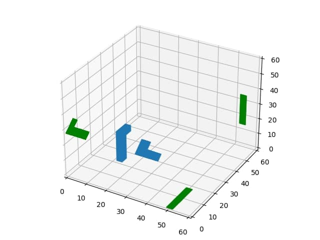

# KG6
lab6, Hryshkin

## Task

Write an application / web application in which a given three-dimensional object (wireframe) is formed and rendered.
Supplement the application / web application by implementing the construction of three orthographic projections of a given object (on the coordinate planes Oxy, Oxz, Oyz). 

## Initial

## the requirements 
* win10 latest version

## Installation and usage

Run lab6.exe